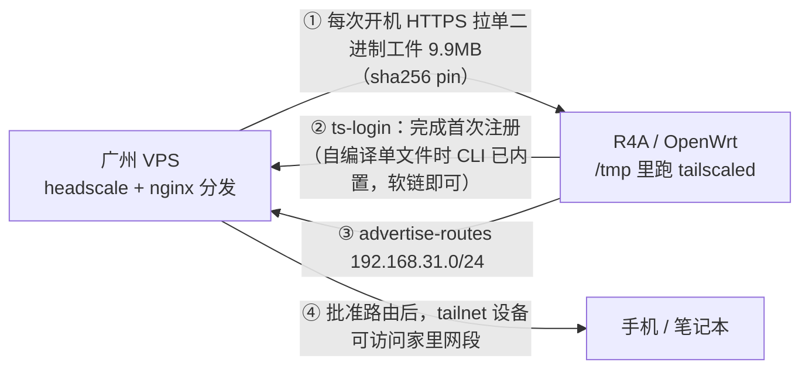

# R4A 千兆版：开机把 Tailscale 拉进内存运行

目标：OpenWrt 路由器**不安装** tailscale 包（16MB flash 装不下），每次开机从自己的服务器把二进制拉进 `/tmp`（tmpfs）运行，接入已有的 headscale。



## 一、先看实测结论：工件从哪来

以下都是在本机实测的（2026-09，`tailscale 1.102.4` / OpenWrt 24.10.0 / mipsel）：

| 来源 | 版本 | 二进制情况 | 解压后 | 下载量 |
|---|---|---|---|---|
| **自己编译**（推荐） | 任选 tag | **单文件**，`ts_include_cli` 把 CLI 合进去 | **30.5MB** | **9.9MB** |
| 官方静态包 | 1.102.4 | `tailscaled` + `tailscale` **两个**（38.7MB / 32.1MB） | 70.8MB | daemon 17.7MB + CLI 14.3MB |
| OpenWrt ipk | 24.10 只有 1.80.3 | **单二进制**，自带 CLI | 较小 | ~10MB |
| OpenWrt snapshots | 1.102.3 | **改成 apk（ADB 容器）**，常规工具拆不了 | — | 9.9MB |

> 自编译这条路是实测过的：`ts_include_cli` 生效时，同一个文件以 `tailscale` 为名运行就是完整 CLI
> （`./tailscale version` 正常输出，`./tailscale status` 报"连不上本地 daemon"），
> 以 `tailscaled` 为名运行则是 daemon。官方二进制不这样 —— 以 `tailscale` 为名运行仍报
> `tailscaled does not take non-flag arguments`。

官方 mipsle 构建的 ELF 实测属性：`ELF32 LSB MIPS32, o32, cpic, **Soft float**, statically linked`（0 个 NEEDED）—— MT7621 是 24KEc，**无 FPU**，Soft float 正好匹配；全静态也就不依赖 OpenWrt 的 musl 版本，比 ipk 那条路更稳。

两个决定设计的实测结论：

1. **官方 `tailscaled` 不含 CLI**。把它以 `tailscale` 之名调用会报：
   `tailscaled does not take non-flag arguments: ["version"]`
   → 注册那一次必须两个二进制都在。而 OpenWrt 的包靠 `ts_include_cli` 编译选项做成单二进制，才能软链出 CLI。
2. **`tailscaled --version` 可用**（rc=0）→ 自检不用依赖 CLI。

于是方案定为：**自己编译单二进制**，同时三种工件来源都支持：

| 环节 | 脚本 | 说明 |
|---|---|---|
| 自编译 | `server/build-selfbuild.sh` | 本地交叉编译单二进制（含 CLI），带行为断言 |
| 打包 | `server/make-artifact.sh` | VPS：把二进制打成 `tar.gz` + sha256（`official` / `openwrt` / `local`） |

## 二、目录

| 路径 | 用途 |
|---|---|
| `server/build-selfbuild.sh` | 本地：交叉编译单二进制，断言 CLI 行为 + 软浮点 + 静态（没 Go 会自己装） |
| `server/make-artifact.sh` | VPS：打成 `tar.gz` + sha256，并生成可直接用的 `ts.conf.local` |
| `server/headscale-bootstrap.sh` | VPS：建 user、发 preauthkey、打印 autoApprovers 片段 |
| `server/nginx-ts.conf.example` | VPS：443 + 随机路径托管工件 |
| `router/bootstrap.sh` | 路由器：从仓库拉一份快照并安装（**免 scp**） |
| `router/install.sh` | 安装 + 可选地把配置一次性写进去（`--artifact` / `--login-server` / `--authkey` …） |
| `router/ts.conf` | 路由器：配置模板（默认值）；真实值放同名 `.local`，模板可被放心覆盖 |
| `router/ts-fetch` | 下载 → 校验 → 解包 → 自检；`--with-cli` 时才拉 CLI |
| `router/ts-login` | 首次注册：拉 daemon + 临时 CLI → `tailscale up` → 删 CLI 和 authkey |
| `router/ts-doctor` | 逐项体检：配置 / 依赖 / 资源 / 网络 / 工件可达性 / 运行态 |
| `router/ts-status` | 看节点状态；CLI 不在内存就自动拉，用完自动删 |
| `router/tailscale-ram` | procd 服务：开机拉取、守护 daemon、按需 `tailscale up` |

---

# 三、服务器（广州 VPS）

## 0. 推荐：先在自己电脑上编一个单二进制

比官方包小一半、且自带 CLI，所以不需要"注册时临时拉 CLI"这套绕路。

Linux / macOS / WSL：

```sh
bash server/build-selfbuild.sh          # 默认 VER=1.102.4，可 VER=1.110.0
# 产物：out/tailscaled_1.102.4_mipsle（+ .sha256）
```

脚本内置两道断言，防止发出跑不起来的包：

1. 先用**同样的 flags 编一个 amd64 版**并运行 `./tailscale version` —— 断言 `ts_include_cli` 真的把 CLI 合进来了
   （mipsle 二进制没法在本机执行，所以用同 flag 的 amd64 版做行为验证）
2. 再对 mipsle 产物断言 `FP ABI: Soft float` + 无 `NEEDED`（静态）

**Go 环境它会自己准备**（实测四种情形都跑过）：

| 本机情况 | 行为 |
|---|---|
| 有 Go 且版本够（≥ go.mod 要求） | 直接用 |
| 有 Go 但偏低（≥ 1.21） | 交给 `GOTOOLCHAIN=auto` 自动拉工具链 |
| 完全没有 Go | 从 go.dev 下官方 tarball（校验 sha256）到临时目录，**用完即弃，不需要 root** |
| `GO_BOOTSTRAP=0` | 缺 Go 直接报错，不自动装 |

可调项：`GO_VERSION=1.27.1`（强制版本）、`GO_MIRRORS="https://go.dev https://golang.google.cn"`（下载源）。

Windows 原生（已装 Go ≥ 1.26）：

```powershell
$env:CGO_ENABLED="0"; $env:GOOS="linux"; $env:GOARCH="mipsle"; $env:GOMIPS="softfloat"
git clone --depth 1 --branch v1.102.4 https://github.com/tailscale/tailscale
cd tailscale
go build -trimpath -o ..\tailscaled_1.102.4_mipsle -tags "ts_include_cli,ts_omit_aws,ts_omit_bird,ts_omit_clientupdate,ts_omit_completion,ts_omit_kube,ts_omit_systray,ts_omit_taildrop,ts_omit_tap,ts_omit_tpm" -ldflags "-s -w -X tailscale.com/version.longStamp=1.102.4-selfbuilt -X tailscale.com/version.shortStamp=1.102.4" .\cmd\tailscaled
```

编好后传到 VPS 打包（tar 交给 VPS，省得在 Windows 上折腾）：

```sh
scp tailscaled_1.102.4_mipsle root@<vps>:/root/
# 在 VPS 上：
SOURCE=local BINARY=/root/tailscaled_1.102.4_mipsle bash server/make-artifact.sh
```

`SOURCE=local` 会再校验一次软浮点/静态才打包，并把配好的 `ts.conf.local` 生成到 `OUT`。

## 1. 生成工件（不想自己编，就用官方静态包）

```sh
sudo mkdir -p /srv/ts
sudo OUT=/srv/ts BASE_URL=https://dl.example.com/ts/<token> bash server/make-artifact.sh
```

默认走官方静态构建，会自动校验官方 `.sha256` sidecar。输出里既有工件行，也有**可直接复制的安装参数**：

```
   <sha-daemon> https://.../tailscaled_1.102.4_mipsle.tar.gz      # TS_ARTIFACTS
   <sha-daemon> https://.../tailscale-cli_1.102.4_mipsle.tar.gz   # TS_CLI_ARTIFACTS

==================== 给路由器的配置 ====================
文件：/srv/ts/ts.conf.local
两种用法二选一：
  A) 拷文件：scp /srv/ts/ts.conf.local root@192.168.31.1:/etc/tailscale/ts.conf.local
  B) 当参数传（不拷文件，装的时候直接写进去）：
       --artifact "<sha> <url>"
```

可选：`SOURCE=openwrt` 走 24.10 的 ipk 拆包（单二进制、自带 CLI，但版本只有 1.80.3）。

> 注意：snapshots/main 已经是 apk（ADB 容器），脚本会明确报错提示，不会静默产出坏包。

## 2. 托管

```sh
sudo cp server/nginx-ts.conf.example /etc/nginx/conf.d/ts-download.conf
openssl rand -hex 16          # 填进配置的 PASTE_RANDOM_TOKEN
sudo nginx -t && sudo systemctl reload nginx
curl -I https://dl.example.com/ts/<token>/tailscaled_1.102.4_mipsle.tar.gz
```

要点：复用 443（headscale 已放行）、路径带随机 token、`autoindex off`。工件在路由器侧有 sha256 pin，分发点被劫持也喂不进恶意二进制。

## 3. headscale 侧

```sh
headscale users create home
headscale preauthkeys create --user home --reusable --expiration 24h

# 路由器注册成功后批准路由
headscale routes list
headscale routes enable -r <route-id>
```

免人工批准（字段名按你的版本核对）：

```json
"autoApprovers": {
  "routes":   { "192.168.31.0/24": ["home"] },
  "exitNode": ["home"]
}
```

ACL 里也要放行 `192.168.31.0/24`，否则路由批准了也访问不了。

上面这些手工步骤也可以交给脚本（`server/headscale-bootstrap.sh`）：它建 user、发 preauthkey、把该贴的 `autoApprovers` 片段和随后要用的命令直接打出来。

```sh
# headscale 跑在容器里时：HEADSCALE_CMD="docker exec headscale headscale" bash …
bash server/headscale-bootstrap.sh --user home --routes 192.168.31.0/24
```

它**不改 headscale 的配置文件**（那要重启服务），只打印片段交给你自己决定。

---

# 四、路由器

## 1. 落地（两种方式，二选一）

**方式 A：一条命令从仓库装（不用 scp，推荐）**

```sh
wget -O- https://raw.githubusercontent.com/Kirinni/ts-plan/main/router/bootstrap.sh | sh -s -- \
  --ref <commit> \
  --artifact "<sha256> <url>" \
  --login-server https://hs.example.com \
  --routes 192.168.31.0/24 \
  --authkey -
```

按提示把 preauthkey 粘进去回车（`--authkey -` 从 stdin 读，不会留在 shell history）。装完配置已经写好，直接可用。

> `--ref` 建议写具体 commit（内容不可变），别只跟 `main`：公开仓库一旦被改动，你的生产脚本会跟着变。

**方式 B：先拷文件再装**

```sh
scp -r router/* root@192.168.31.1:/root/ts-kit/
sh /root/ts-kit/install.sh \
  --artifact "<sha256> <url>" \
  --login-server https://hs.example.com \
  --routes 192.168.31.0/24
```

`install.sh` 的全部参数（`-h` 也能看）：

| 参数 | 作用 |
|---|---|
| `--artifact "<sha256> <url>"` | 工件条目，可重复（按顺序回退） |
| `--url` + `--sha` | 等价于一条 `--artifact` |
| `--cli-artifact "<sha> <url>"` | 只有官方静态包需要（它不含 CLI） |
| `--login-server` / `--routes` / `--hostname` | 写进配置 |
| `--authkey <key>` / `--authkey -` | 写 authkey 文件（`-` 表示从 stdin 读） |
| `--no-start` / `--force` | 只安装不启动 / 覆盖已有 ts.conf 模板 |

## 2. 配置怎么分层（重要）

| 文件 | 谁写 | 会不会被覆盖 |
|---|---|---|
| `/etc/tailscale/ts.conf` | 仓库模板（默认值） | 重跑 `install.sh` 时**保留**（除非 `--force`） |
| `/etc/tailscale/ts.conf.local` | `install.sh` 传参写的、或你手填的**真实值** | 会被重跑覆盖，但旧内容自动备份成 `.bak` |

`ts.conf` 末尾会 source 那个 `.local`，所以真实值永远优先。这样**升级脚本时重装不会丢配置** —— 之前是直接 `cp -f ts.conf` 覆盖，填好的 sha/URL/域名全没了。

用 `--artifact` 传参时 `install.sh` 自动写 `.local`；也可以让 `make-artifact.sh` 生成好再拷过去（它会把 sha 和 URL 拼好，省得手抄）：

```sh
scp /srv/ts/ts.conf.local root@192.168.31.1:/etc/tailscale/ts.conf.local
```

三种来源都不需要改 `ts.conf` 模板：

- **自编译单二进制**：`TS_ARTIFACTS` 一条即可（CLI 就在同一个文件里，`ts-fetch` 软链出 `tailscale`）。
- **官方静态包**：`TS_ARTIFACTS` + `TS_CLI_ARTIFACTS` 各一条（daemon 与独立 CLI）。
- **OpenWrt ipk**：同自编译，一条即可。

## 3. 首次注册：`ts-login`

```sh
ts-login
```

它依次做：拉 daemon → 确保有 CLI → 启动服务 → `tailscale up --login-server=... --authkey=... --advertise-routes=...` →（官方包路径）**成功后删掉 CLI**（省 32MB）→ **删掉 authkey 文件**（state 已持久化，它再也用不上了）。

失败时保留 CLI 便于重试。想留着 authkey 方便以后重新注册：`DELETE_AUTHKEY_AFTER_LOGIN=0`。

之后每次开机只走 `ts-fetch`：自编译单二进制重下 9.9MB，官方包只下 17.7MB 的 daemon。都不再需要单独的 CLI —— 因为 `tailscaled.state` 里已经存了 prefs，daemon 启动会自行恢复连接。

> **首装是内存最紧张的时刻**（官方包路径：daemon 38.7 + CLI 解包 32.1 + CLI 包 14.3 ≈ 85MB，加上系统约 120MB）。
> 若首装报 `No space left on device` 或进程被 OOM 杀掉：先 `wifi down` 释放十几 MB 再跑 `ts-login`，完事 `wifi up`。
> 用自编译单二进制（30.5MB 一个文件）没这个问题。

## 4. 运行期行为

| 内容 | 位置 | 是否持久 |
|---|---|---|
| `tailscaled`（+注册时的 `tailscale`） | `/tmp/tailscale/`（tmpfs） | ❌ 重启重下 |
| `tailscaled.state` | `/etc/tailscale/`（overlay，几十 KB） | ✅ 保住节点身份 |
| `authkey` | `/etc/tailscale/authkey` | ✅ 只在没有 state 时才用 |
| `/tmp/ts-fetch.log`、`/tmp/ts-up.log` | tmpfs | ❌ 排错用 |

设计要点：

- 开机 `START=99` 检查 tmpfs 里有没有二进制，没有就**后台**拉取，成功后自动重入 `start`，不阻塞启动。
- 拉取前等网络就绪（默认路由 + DNS），`MAX_ATTEMPTS × 工件数` 轮重试 + 退避；`/tmp/.ts-fetch-running` 防止并发重复拉取。
- 缓存标记 `.installed.sha256` / `.cli.sha256`：同一次开机内重启服务不会重复下载。
- `--accept-dns=false`（路由器自己跑 dnsmasq）、`--snat-subnet-routes=true`（家里设备无需配置路由）。
- `TMPFS_SIZE=96m`：只抬高上限、不预分配；为的是首装能放下两个二进制。

---

# 五、验证

**第一件事：跑 `ts-doctor`。** 它只读，逐项体检并给出结论，比翻日志快：

```sh
ts-doctor
```

```
== 配置 ==    工件条数 / sha256 格式 / LOGIN_SERVER / 本地覆盖是否存在
== 依赖 ==    curl、/dev/net/tun、tun 模块、CA 证书、sha256sum/tar/gzip
== 资源 ==    可用内存、/tmp 余量 vs TMPFS_SIZE、本地包解压后大小
== 网络 ==    默认路由、能否解析 LOGIN_SERVER 主机名
== 工件 ==    每个 URL 是否可达；本地有同名包时顺带核对 sha256
== 运行态 ==  二进制自检、daemon 进程、socket、state、tailscale0
```

退出码 0 = 没有 FAIL；1 = 有 FAIL；2 = 连配置都找不到。

看节点状态：

```sh
ts-status             # 等价 tailscale status，并补上 tailscale0 的地址和路由
ts-status --json      # 其它子命令原样透传
```

CLI 不在内存时它会自动拉，用完自动删（官方包路径省 32MB）；自编译单二进制下 CLI 是常驻软链，不折腾。

其它：

```sh
# 路由器
tail -f /tmp/ts-fetch.log          # 下载/校验/解包
tail -f /tmp/ts-up.log             # tailscale up
ip -4 addr show tailscale0
ip route | grep 100.               # tailnet 路由

# 服务器
headscale nodes list
headscale routes list              # 家网段应为 enabled
```

客户端侧：必须开 `--accept-routes`（手机端 "Use Tailscale subnets"），policy 允许该网段。

---

# 六、排错

| 现象 | 处理 |
|---|---|
| 不知道哪里不对 | **先跑 `ts-doctor`**，它会直接告诉你是哪一项 FAIL |
| `No space left on device` / 进程被杀 | 只会在用官方静态包（daemon+CLI 共 70.8MB）时出现：`wifi down` 后重试，或调大 `TMPFS_SIZE`。用自编译单二进制不存在此问题 |
| 日志出现 `tailscaled does not take non-flag arguments` | 你在拿官方 `tailscaled` 当 CLI 用 → 走 `ts-login` / `ts-fetch --with-cli` |
| `ts-login` 报 "无 CLI 且无 state" | 先填 `TS_CLI_ARTIFACTS`，再执行 `ts-fetch --with-cli` |
| 下载一直失败 | 路由器上 `curl -I <url>` 手测；确认 token 路径、nginx、家宽到 VPS 的 443 |
| sha256 不匹配 | 重新跑 `make-artifact.sh` 并把新 sha 写进 `ts.conf.local`（或重跑 `install.sh --artifact`） |
| 官方 sidecar 校验失败 | 网络/镜像问题，重下；别跳过校验 |
| 改了 `ts.conf` 却不生效 | 真实值应放 `ts.conf.local`（它最后 source，优先）；`ts-doctor` 会报告有没有这个文件 |
| 重跑 `install.sh` 后配置"回退"了 | 检查 `ts.conf.local` 与 `.bak`：传参重跑会覆盖 `.local`，旧值在 `.bak` 里 |
| 服务器能看到节点但路由 pending | `headscale routes enable -r <id>` 或配 `autoApprovers` |
| 路由 enabled 但客户端访问不了内网 | 客户端没开 `--accept-routes`；ACL 未放行；家网段与 `100.64.0.0/10` 冲突 |
| 能 ping 路由器但访问不了内网设备 | 确认 `net.ipv4.ip_forward`；必要时手工放行：<br>`nft add rule inet fw4 forward iifname "tailscale0" accept`<br>`nft add rule inet fw4 forward oifname "tailscale0" ct state established,related accept` |
| 换版本后行为不对 | 换工件后必须同步 sha；`rm -rf /tmp/tailscale` 再 `/etc/init.d/tailscale-ram restart` |

---

# 七、取舍（如实说明）

- **每次重启重下 9.9MB**（自编译单二进制）或 17.7MB（官方包）：这是不占 flash 的代价。把工件多放一两个地方（第二台机器/对象存储）能显著降低单点失败概率。
- **自编译方案下内存很宽裕**：常驻一个 30.5MB 的文件，日常压力约 55–80MB。
  走官方包时才紧张：首装 daemon+CLI 同时在内存约 85MB，必要时先 `wifi down` 再 `ts-login`。
- **state 写在 overlay**：写入频率低（状态变化/密钥轮换），但确实消耗 NOR 寿命。
- **MT7621 性能上限**：tailscale 加密吞吐大约 20–50Mbps，回家 SSH/看页面没问题，当出口节点跑满带宽不现实。
- **`authkey` 过期不影响已注册节点**（有 state 时不需要重新注册）。
- 版本自由：`VER=1.110.0 bash server/build-selfbuild.sh`，或 `SOURCE=official VER=1.110.0 ...`。
  headscale 只支持最近 10 个客户端版本，别落后太多。
