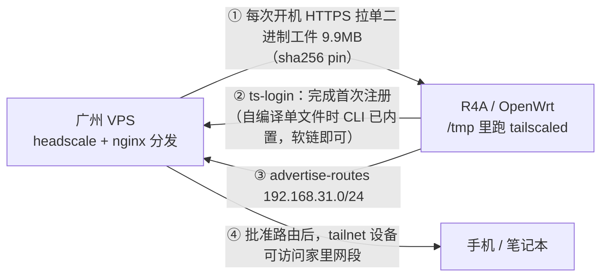

# R4A 千兆版：开机把 Tailscale 拉进内存运行

目标：OpenWrt 路由器**不安装** tailscale 包（16MB flash 装不下），每次开机从自己的服务器把二进制拉进 `/tmp`（tmpfs）运行，接入已有的 headscale。



## 一、先看实测结论：工件从哪来

以下都是在本机实测的（2026-09，`tailscale 1.102.4` / OpenWrt 24.10.0 / mipsel）：

| 来源 | 版本 | 二进制情况 | 解压后 | 下载量 |
|---|---|---|---|---|
| **自己编译**（推荐） | 任选 tag | **单文件**，`ts_include_cli` 把 CLI 合进去 | **30.5MB** | **9.9MB** |
| 官方静态包 | 1.102.4 | `tailscaled` + `tailscale` **两个**（38.7MB / 32.1MB） | 70.8MB | daemon 17.7MB + CLI 14.3MB |
| OpenWrt ipk | 24.10 只有 1.80.3 | **单二进制**，自带 CLI | 较小 | ~10MB |
| OpenWrt snapshots | 1.102.3 | **改成 apk（ADB 容器）**，常规工具拆不了 | — | 9.9MB |

> 自编译这条路是实测过的：`ts_include_cli` 生效时，同一个文件以 `tailscale` 为名运行就是完整 CLI
> （`./tailscale version` 正常输出，`./tailscale status` 报"连不上本地 daemon"），
> 以 `tailscaled` 为名运行则是 daemon。官方二进制不这样 —— 以 `tailscale` 为名运行仍报
> `tailscaled does not take non-flag arguments`。

官方 mipsle 构建的 ELF 实测属性：`ELF32 LSB MIPS32, o32, cpic, **Soft float**, statically linked`（0 个 NEEDED）—— MT7621 是 24KEc，**无 FPU**，Soft float 正好匹配；全静态也就不依赖 OpenWrt 的 musl 版本，比 ipk 那条路更稳。

两个决定设计的实测结论：

1. **官方 `tailscaled` 不含 CLI**。把它以 `tailscale` 之名调用会报：
   `tailscaled does not take non-flag arguments: ["version"]`
   → 注册那一次必须两个二进制都在。而 OpenWrt 的包靠 `ts_include_cli` 编译选项做成单二进制，才能软链出 CLI。
2. **`tailscaled --version` 可用**（rc=0）→ 自检不用依赖 CLI。

于是方案定为：**自己编译单二进制**，同时三种工件来源都支持：

| 环节 | 脚本 | 说明 |
|---|---|---|
| 自编译 | `server/build-selfbuild.sh` | 本地交叉编译单二进制（含 CLI），带行为断言 |
| 打包 | `server/make-artifact.sh` | VPS：把二进制打成 `tar.gz` + sha256（`official` / `openwrt` / `local`） |

## 二、目录

> **第一次部署请直接看「三、从零部署（照着走一遍）」**：那份是按时间顺序的操作手册，
> 下面的章节是按组件组织的参考细节。

| 路径 | 用途 |
|---|---|
| `server/build-selfbuild.sh` | 本地：交叉编译单二进制，断言 CLI 行为 + 软浮点 + 静态（没 Go 会自己装） |
| `.github/workflows/build.yml` | **CI：编译 → 打包 → 导出快照 → 发 Release**（见「三 → 2.5」） |
| `server/pull-release.sh` | **VPS：一条命令把 CI 发的 Release 拉下来铺到分发点**（不用 scp、不用密钥） |
| `server/make-ts-conf.sh` | 生成 `ts.conf.local`（`make-artifact.sh` 与 `pull-release.sh` 共用同一份格式） |
| `server/make-artifact.sh` | VPS：打成 `tar.gz` + sha256，并生成可直接用的 `ts.conf.local` |
| `server/make-repo-archive.sh` | VPS：导出仓库快照 + bootstrap 到分发点，让路由器不碰 GitHub |
| `server/headscale-bootstrap.sh` | VPS：建 user、发 preauthkey、打印 autoApprovers 片段 |
| `server/nginx-ts.conf.example` | VPS：443 + 随机路径托管工件 |
| `router/bootstrap.sh` | 路由器：从仓库拉一份快照并安装（**免 scp**） |
| `router/install.sh` | 安装 + 可选地把配置一次性写进去（`--artifact` / `--login-server` / `--authkey` …） |
| `router/ts.conf` | 路由器：配置模板（默认值）；真实值放同名 `.local`，模板可被放心覆盖 |
| `router/ts-fetch` | 下载 → 校验 → 解包 → 自检；`--with-cli` 时才拉 CLI |
| `router/ts-login` | 首次注册：拉 daemon + 临时 CLI → `tailscale up` → 删 CLI 和 authkey |
| `router/ts-doctor` | 逐项体检：配置 / 依赖 / 资源 / 网络 / 工件可达性 / 运行态 |
| `router/ts-status` | 看节点状态；CLI 不在内存就自动拉，用完自动删 |
| `router/tailscale-ram` | procd 服务：开机拉取、守护 daemon、按需 `tailscale up` |

---

# 三、从零部署（照着走一遍）

> 涉及三台机器：**你的电脑**（编译）→ **VPS**（分发 + headscale）→ **路由器**（运行）。
> 每步末尾有**检查点**，过不了就别往下走。出错先看「七、排错」。
> 全程只有第 3、4、6 步需要替换成你自己的值（域名 / token / 网段）。
>
> 不想在本机装 Go、也不想 scp？第 1、3 步可以完全交给 GitHub Actions（见 2.5）：
> 电脑上什么都不用装，VPS 上只需跑一次 `server/pull-release.sh`（脚本本身从仓库拿一份即可）。

## 0. 前提

| 需要 | 怎么确认 |
|---|---|
| 路由器已刷 OpenWrt，能上网 | `opkg update` 能通 |
| 一台能访问 GitHub 的 VPS | 只有"取源码 / 取官方包"这一步用得到，**路由器不需要访问 GitHub** |
| headscale 已在 VPS 跑起来 | `headscale version` 有输出 |
| 一个域名 + 证书 | 用于 HTTPS 分发工件；可以复用 headscale 的域名，换个路径 |
| 本机有 Go ≥ 1.26（可选） | 没有也行：`build-selfbuild.sh` 会自己下一个临时的；或者干脆用 GitHub Actions（见 2.5） |

## 1. 编一个单二进制（你的电脑上）

```sh
bash server/build-selfbuild.sh            # 默认 VER=1.102.4
```

**检查点**：出现这三行，并且产物在 `out/`

```
   OK 单文件自带 CLI：1.102.4
   OK Soft float + 静态链接（readelf）
体积   : raw 30.5 MB | gzip 9.9 MB（≈ 每次开机下载量）
```

> 为什么自己编：单文件 30.5MB、自带 CLI、gzip 后 9.9MB；官方静态包要两个文件共 70.8MB。
> 详见「一、先看实测结论」。

## 2. 传到 VPS

```sh
scp out/tailscaled_1.102.4_mipsle root@<你的VPS>:/root/
```

> 不想手做第 1、2、3 步？直接看下面的 **2.5** —— GitHub Actions 负责编和打包（不用本机装 Go），
> VPS 再用一条命令把它拉下来（不用 scp、不用配密钥）。

## 2.5 让 GitHub Actions 编，VPS 自己拉（可选，但真的省事）

`.github/workflows/build.yml` 在 GitHub 的机器上把三件事做完，等价于本机做第 1 步 + 第 3 步：

```
编译         server/build-selfbuild.sh     （CLI 行为 / 软浮点 / 静态 三项断言）
打包         server/make-artifact.sh       → tar.gz + sha256 + ts.conf.local
仓库快照     server/make-repo-archive.sh   → archive/<commit>.tar.gz + bootstrap.sh
发 Release   固定文件名 + BUILD_INFO.txt   → 供 VPS / 路由器匿名下载
```

**为什么不让 CI 直接 ssh 推给 VPS**：那要在 GitHub 侧存一把能登你服务器的私钥 —— GitHub 侧
一旦出事（账号被撞、第三方 Action 被投毒），丢的不只是仓库，而是服务器。改成"VPS 主动拉"之后，
**GitHub 侧一个密钥都不用存**，而且公开仓库的 Release 是匿名可下的，连下载凭据都不需要。
（如果你确实想 CI 直接推，`2b553d7` 那版实现还在 git 历史里。）

### 怎么用

1. **让 CI 编 + 发 Release**（二选一）：

   | 方式 | 行为 |
   |---|---|
   | `git tag v1.102.4 && git push origin v1.102.4` | 版本号取 tag 名，编完自动发 Release（推荐） |
   | Actions 页面 *Run workflow* | 可填版本号 / Release 标签（留空就只编不发） |
   | 改到 `server/` `router/` 的 PR | 只跑脚本语法/行尾检查 + 编译，不发 Release |

   可选的 Variables（**Settings → Secrets and variables → Actions**，都不是机密，纯省打字）：
   `TS_BASE_URL`（分发前缀）、`TS_LOGIN_SERVER`、`TS_ADVERTISE_ROUTES`、`TS_VER`。
   **Secrets 一个都不用配。**

2. **在 VPS 上一条命令拉下来铺好**：

   ```sh
   # VPS 上（本仓库的一份 clone 里）
   REPO=Kirinni/ts-plan TAG=latest OUT=/srv/ts \
   BASE_URL=https://dl.example.com/ts/<你的token> \
   LOGIN_SERVER=https://hs.example.com ADVERTISE_ROUTES=192.168.31.0/24 \
     bash server/pull-release.sh
   ```

   它会：拉 `BUILD_INFO.txt` 认出版本和 commit → 下载工件并**校验 sha256** → 铺成
   `/srv/ts/tailscaled_<ver>_mipsle.tar.gz`、`/srv/ts/archive/<commit>.tar.gz`、`/srv/ts/bootstrap.sh`
   → 生成 `/srv/ts/ts.conf.local` → 把第 6 步要用的整条路由器命令打印出来
   （顺带回下一遍分发点，确认 nginx 真的能下、且 sha 一致）。

   **检查点**：结尾出现 `OK 分发点上能下到，且 sha256 一致`，以及一段
   `wget -O- …/bootstrap.sh | sh -s -- …`。那一段就是第 6 步。

   > 拉的是最新那次发布的版本：`TAG=v1.102.4` 可以指定；`TAG=latest` 等于"最近发的那个"。
   > 完全离线（比如 CI 编完你手动把 zip 传上去）也能用：`--from <目录>`。
   > 仓库要是转成私有，就在 VPS 上放一把**只读** token：`IN_TOKEN=ghp_…`。

3. 之后的升级就是重复 1、2：CI 编 → VPS 拉 → 路由器上重跑那条命令（`install.sh` 会就地更新）。

**跑完看 job 的 Summary**：里面已经写好上面第 2 步的完整命令（含你的分发点前缀），复制粘贴即可；
另外还有 Actions Artifact（保留 90 天）和 Release 里的版本化资产，可以当回滚用的历史版本。

> 打包做了可复现处理（固定 tar 的 mtime/uid/gid + `gzip -n`）：同一个二进制在 CI 上重跑、
> 在别的机器上重打，得到的 tar.gz sha256 都一样，不用每次重抄 `--artifact`。
>
> 公开仓库的 **run 日志 / Summary 是公开可见的**，而里面带着你的分发点地址（可能含随机 token）。
> 那个 token 只是"挡住爬虫"用的路径，不是密钥 —— 介意的话就当它是公开地址，或者别把
> 重要东西放在那条路径后面。

## 3. 在 VPS 上打包，并生成路由器配置

> 下面默认你在 VPS 上就是 **root**（自己的机器常见如此）。用普通用户时，注意
> 别让 `sudo` 去跑需要 git 的命令（root 打开属于你的仓库会报 *dubious ownership*）。

```sh
# 在 VPS 上（本仓库的一份 clone 里）
mkdir -p /srv/ts
SOURCE=local BINARY=/root/tailscaled_1.102.4_mipsle \
     OUT=/srv/ts BASE_URL=https://dl.example.com/ts/<你的token> \
     bash server/make-artifact.sh
```

这一步会做三件事：校验软浮点/静态 → 打成 `tar.gz` + sha256 → **生成 `/srv/ts/ts.conf.local`**（省得你手抄那行长 URL）。

**检查点**：输出里有 `==================== 给路由器的配置 ====================`，并打印出 `--artifact "<sha> <url>"` 那一行 —— **把这段复制下来，第 6 步要用**。

> 用了 GitHub Actions（2.5）就不用做第 3 步：本机编译和 VPS 打包都被 CI 顶掉了，
> VPS 上只需跑一次 `server/pull-release.sh`。

## 4. 让 VPS 通过 HTTPS 分发（顺便把仓库快照也放上）

```sh
cp server/nginx-ts.conf.example /etc/nginx/conf.d/ts-download.conf
openssl rand -hex 16                    # 生成随机路径 token，填进配置
nginx -t && systemctl reload nginx

# 顺手导出仓库快照，让路由器安装时也不用碰 GitHub
OUT=/srv/ts BASE_URL=https://dl.example.com/ts/<token> \
  bash server/make-repo-archive.sh
```

**检查点**：

```sh
curl -I https://dl.example.com/ts/<token>/tailscaled_1.102.4_mipsle.tar.gz   # 200
curl -I https://dl.example.com/ts/<token>/bootstrap.sh                       # 200
```

`make-repo-archive.sh` 会把它算出的**快照 sha256** 和第 6 步要用的完整命令一起打出来。

> 用了 GitHub Actions（2.5）就不用做第 4 步的后半段：`pull-release.sh` 会把 `bootstrap.sh` 和
> `archive/<commit>.tar.gz` 一起放好。

> 只想最省事、不介意路由器安装时访问 GitHub？第 4 步的后半段可以跳过 —— 安装那一次从 GitHub 取脚本即可，**开机路径仍然只访问你的 VPS**。

## 5. 建用户、发 preauthkey（VPS 上）

```sh
bash server/headscale-bootstrap.sh --user home --routes 192.168.31.0/24
```

**检查点**：打印出 `tskey-auth-…` 和一段 `autoApprovers` 配置片段。
headscale 跑在容器里时加前缀：`HEADSCALE_CMD="docker exec headscale headscale" bash server/headscale-bootstrap.sh …`

## 6. 路由器上安装（一条命令）

```sh
# 推荐：从自己的服务器装（全程不碰 GitHub）
wget -O- https://dl.example.com/ts/<token>/bootstrap.sh | sh -s -- \
  --base-url https://dl.example.com/ts/<token> \
  --ref <第 4 步的 commit> --sha256 <第 4 步的快照 sha> \
  --artifact "<第 3 步的 sha> <第 3 步的 url>" \
  --login-server https://hs.example.com \
  --routes 192.168.31.0/24 \
  --authkey 'tskey-auth-…'
```

（`--authkey -` 也行：会在终端提示你粘贴 key，不留在 shell history。管道形式下它优先读终端，所以照样能用。）

也可以先 scp 再装（完全离线，见「五、路由器」的方式 C）。

**检查点**：安装脚本最后提示"下一步：ts-doctor"。等 30 秒左右，然后：

```sh
ts-doctor        # 期望：没有 FAIL；"运行态"里能看到二进制、daemon、socket
```

## 7. 注册

| 你用的工件 | 怎么注册 |
|---|---|
| **自编译单二进制**（本文推荐） | **自动**。安装时给了 `--authkey`，`tailscale-ram` 拉完二进制就会自己 `up`，等 10–60 秒即可 |
| 官方静态包 | 需要手工一次：`ts-login`（它会临时拉 CLI，注册完自动删掉） |

**检查点**：

```sh
ts-status                 # 应看到自己的节点在线
headscale nodes list      # 服务器上应出现 r4a-home 之类的节点
```

## 8. 批准路由

```sh
headscale routes list
headscale routes enable -r <route-id>
```

或者用第 5 步打印的 `autoApprovers` 片段写进 headscale 的 `config.yaml`，重启 headscale 后免人工批准。

**检查点**：`headscale routes list` 里家网段是 `enabled`。

## 9. 客户端验证 + 重启验证（别跳过）

客户端（手机 / 笔记本）**必须开** `--accept-routes`（手机端叫 "Use Tailscale subnets"），ACL 也要放行该网段。

然后**重启路由器**，这是最关键的一步：

```sh
reboot
# 回来后
ts-status                 # 节点应自己回来（开机自动重下 9.9MB）
```

想验证掉线自愈：重启后立刻拔掉 WAN 十几秒，`tail -f /tmp/ts-fetch.log` 里应出现
`拉取失败（第 N 次），Xs 后重试`；把网接回来，它会自己恢复，不用你做任何事。

---

## 部署最短路径（老手速查）

```sh
# 电脑（手工路线）
bash server/build-selfbuild.sh && scp out/tailscaled_*_mipsle root@<vps>:/root/
```

**又或者：**本机不装 Go —— 推个 tag 让 CI 编完发 Release，然后在 VPS 上拉一次（详见「三 → 2.5」）：

```sh
# 电脑
git tag v1.102.4 && git push origin v1.102.4

# VPS（不用 scp、不用密钥；结尾会打印第 6 步要用的完整安装命令）
REPO=Kirinni/ts-plan TAG=latest OUT=/srv/ts \
  BASE_URL=https://dl.example.com/ts/<token> \
  LOGIN_SERVER=https://hs.example.com ADVERTISE_ROUTES=192.168.31.0/24 \
  bash server/pull-release.sh
```

```sh
# VPS（手工路线）
mkdir -p /srv/ts
SOURCE=local BINARY=/root/tailscaled_1.102.4_mipsle \
  OUT=/srv/ts BASE_URL=https://dl.example.com/ts/<token> bash server/make-artifact.sh
REF=$(git rev-parse HEAD) OUT=/srv/ts BASE_URL=https://dl.example.com/ts/<token> \
  bash server/make-repo-archive.sh
bash server/headscale-bootstrap.sh --user home --routes 192.168.31.0/24

# 路由器（把上面两步打印的值填进去）
wget -O- https://dl.example.com/ts/<token>/bootstrap.sh | sh -s -- \
  --base-url https://dl.example.com/ts/<token> --ref <commit> --sha256 <快照sha> \
  --artifact "<sha> <url>" --login-server https://hs.example.com \
  --routes 192.168.31.0/24 --authkey 'tskey-…'

# 验证
ts-doctor && ts-status
```

## 卡住了看哪节

| 现象 | 去哪 |
|---|---|
| 编译报错、产物跑不起来 | 「一、先看实测结论」+「七、排错」 |
| 不知道哪里不对 | 直接跑 `ts-doctor`，它会指明 |
| 下载失败 / sha 不匹配 | 「七、排错」前两行 |
| 节点上线了但访问不了内网 | 「六、验证」+「七、排错」 |
| 重启后节点掉线 | 「五、路由器 → 4. 运行期行为」里的退避重试说明 |

---

# 四、服务器（广州 VPS）

## 0. 推荐：先在自己电脑上编一个单二进制

> 这一步就是「三、从零部署」的第 1、2 步，这里只展开细节。

比官方包小一半、且自带 CLI，所以不需要"注册时临时拉 CLI"这套绕路。

Linux / macOS / WSL：

```sh
bash server/build-selfbuild.sh          # 默认 VER=1.102.4，可 VER=1.110.0
# 产物：out/tailscaled_1.102.4_mipsle（+ .sha256）
```

脚本内置两道断言，防止发出跑不起来的包：

1. 先用**同样的 flags 编一个 amd64 版**并运行 `./tailscale version` —— 断言 `ts_include_cli` 真的把 CLI 合进来了
   （mipsle 二进制没法在本机执行，所以用同 flag 的 amd64 版做行为验证）
2. 再对 mipsle 产物断言 `FP ABI: Soft float` + 无 `NEEDED`（静态）

**Go 环境它会自己准备**（实测四种情形都跑过）：

| 本机情况 | 行为 |
|---|---|
| 有 Go 且版本够（≥ go.mod 要求） | 直接用 |
| 有 Go 但偏低（≥ 1.21） | 交给 `GOTOOLCHAIN=auto` 自动拉工具链 |
| 完全没有 Go | 从 go.dev 下官方 tarball（校验 sha256）到临时目录，**用完即弃，不需要 root** |
| `GO_BOOTSTRAP=0` | 缺 Go 直接报错，不自动装 |

可调项：`GO_VERSION=1.27.1`（强制版本）、`GO_MIRRORS="https://go.dev https://golang.google.cn"`（下载源）。

Windows 原生（已装 Go ≥ 1.26）：

```powershell
$env:CGO_ENABLED="0"; $env:GOOS="linux"; $env:GOARCH="mipsle"; $env:GOMIPS="softfloat"
git clone --depth 1 --branch v1.102.4 https://github.com/tailscale/tailscale
cd tailscale
go build -trimpath -o ..\tailscaled_1.102.4_mipsle -tags "ts_include_cli,ts_omit_aws,ts_omit_bird,ts_omit_clientupdate,ts_omit_completion,ts_omit_kube,ts_omit_systray,ts_omit_taildrop,ts_omit_tap,ts_omit_tpm" -ldflags "-s -w -X tailscale.com/version.longStamp=1.102.4-selfbuilt -X tailscale.com/version.shortStamp=1.102.4" .\cmd\tailscaled
```

编好后传到 VPS 打包（tar 交给 VPS，省得在 Windows 上折腾）：

```sh
scp tailscaled_1.102.4_mipsle root@<vps>:/root/
# 在 VPS 上：
SOURCE=local BINARY=/root/tailscaled_1.102.4_mipsle bash server/make-artifact.sh
```

`SOURCE=local` 会再校验一次软浮点/静态才打包，并把配好的 `ts.conf.local` 生成到 `OUT`。

## 1. 生成工件（不想自己编，就用官方静态包）

```sh
sudo mkdir -p /srv/ts
sudo OUT=/srv/ts BASE_URL=https://dl.example.com/ts/<token> bash server/make-artifact.sh
```

默认走官方静态构建，会自动校验官方 `.sha256` sidecar。输出里既有工件行，也有**可直接复制的安装参数**：

```
   <sha-daemon> https://.../tailscaled_1.102.4_mipsle.tar.gz      # TS_ARTIFACTS
   <sha-daemon> https://.../tailscale-cli_1.102.4_mipsle.tar.gz   # TS_CLI_ARTIFACTS

==================== 给路由器的配置 ====================
文件：/srv/ts/ts.conf.local
两种用法二选一：
  A) 拷文件：scp /srv/ts/ts.conf.local root@192.168.31.1:/etc/tailscale/ts.conf.local
  B) 当参数传（不拷文件，装的时候直接写进去）：
       --artifact "<sha> <url>"
```

可选：`SOURCE=openwrt` 走 24.10 的 ipk 拆包（单二进制、自带 CLI，但版本只有 1.80.3）。

> 注意：snapshots/main 已经是 apk（ADB 容器），脚本会明确报错提示，不会静默产出坏包。

## 2. 托管

```sh
sudo cp server/nginx-ts.conf.example /etc/nginx/conf.d/ts-download.conf
openssl rand -hex 16          # 填进配置的 PASTE_RANDOM_TOKEN
sudo nginx -t && sudo systemctl reload nginx
curl -I https://dl.example.com/ts/<token>/tailscaled_1.102.4_mipsle.tar.gz
```

要点：复用 443（headscale 已放行）、路径带随机 token、`autoindex off`。工件在路由器侧有 sha256 pin，分发点被劫持也喂不进恶意二进制。

## 3. headscale 侧

```sh
headscale users create home
headscale preauthkeys create --user home --reusable --expiration 24h

# 路由器注册成功后批准路由
headscale routes list
headscale routes enable -r <route-id>
```

免人工批准（字段名按你的版本核对）：

```json
"autoApprovers": {
  "routes":   { "192.168.31.0/24": ["home"] },
  "exitNode": ["home"]
}
```

ACL 里也要放行 `192.168.31.0/24`，否则路由批准了也访问不了。

上面这些手工步骤也可以交给脚本（`server/headscale-bootstrap.sh`）：它建 user、发 preauthkey、把该贴的 `autoApprovers` 片段和随后要用的命令直接打出来。

```sh
# headscale 跑在容器里时：HEADSCALE_CMD="docker exec headscale headscale" bash …
bash server/headscale-bootstrap.sh --user home --routes 192.168.31.0/24
```

它**不改 headscale 的配置文件**（那要重启服务），只打印片段交给你自己决定。

---

# 五、路由器

> **先说清楚两件事**，否则容易误判：
>
> 1. **`bootstrap.sh` 只在安装/升级时跑一次，不在开机路径上。**
> 2. **开机路径只访问 `TS_ARTIFACTS` 里列的地址**（通常是你的 VPS）。`ts-fetch`、`tailscale-ram`、`ts-login` 里没有任何 GitHub 相关代码。
>
> 也就是说：路由器开机连不连 GitHub，完全取决于你把什么写进了 `TS_ARTIFACTS`。**国内家宽不要把 GitHub 放进 `TS_ARTIFACTS`** —— 每次重启都要重新下载（二进制在 tmpfs 里），源不可达时节点就是掉线状态。

## 1. 落地（三种方式，选一个）

> 对应「三、从零部署」的第 6 步；这里把三种安装方式的参数展开。

**方式 A：从自己的服务器装（推荐，路由器完全不碰 GitHub）**

在 VPS 上把仓库快照也放到分发点（和工件同一个 nginx location 即可）：

```sh
# VPS 上（本仓库的一份 clone 里）
REF=<commit> OUT=/srv/ts BASE_URL=https://dl.example.com/ts/<token> \
  bash server/make-repo-archive.sh
```

它会导出 `archive/<commit>.tar.gz`、把 `bootstrap.sh` 放到同一目录，并打印路由器上要执行的命令（含快照 sha256）：

```sh
# 路由器上
wget -O- https://dl.example.com/ts/<token>/bootstrap.sh | sh -s -- \
  --base-url https://dl.example.com/ts/<token> \
  --ref <commit> \
  --sha256 <快照 sha256> \
  --artifact "<sha256> <url>" \
  --login-server https://hs.example.com \
  --routes 192.168.31.0/24 \
  --authkey -
```

`--sha256` 会校验下载到的快照，分发点被动手脚也装不进去。按提示把 preauthkey 粘进去回车（`--authkey -` 从 stdin 读，不会留在 shell history）。

**方式 B：直接从 GitHub 装（只在路由器能顺畅访问 GitHub 时才用）**

```sh
wget -O- https://raw.githubusercontent.com/Kirinni/ts-plan/<commit>/router/bootstrap.sh | sh -s -- \
  --ref <commit> \
  --artifact "<sha256> <url>" \
  --login-server https://hs.example.com \
  --routes 192.168.31.0/24 \
  --authkey -
```

> `--ref` 一定写具体 commit（内容不可变），别跟 `main`：公开仓库一旦被改动，你的生产脚本会跟着变。
> 这条路只有**安装那一次**会碰 GitHub，之后开机都不会。

**方式 C：先拷文件再装（完全离线）**

```sh
scp -r router/* root@192.168.31.1:/root/ts-kit/
sh /root/ts-kit/install.sh \
  --artifact "<sha256> <url>" \
  --login-server https://hs.example.com \
  --routes 192.168.31.0/24
```

也可以 `bootstrap.sh --from <已解压目录>`：快照由你自己拷过去，全程零下载。

`install.sh` 的全部参数（`-h` 也能看）：

| 参数 | 作用 |
|---|---|
| `--artifact "<sha256> <url>"` | 工件条目，可重复（按顺序回退） |
| `--url` + `--sha` | 等价于一条 `--artifact` |
| `--cli-artifact "<sha> <url>"` | 只有官方静态包需要（它不含 CLI） |
| `--login-server` / `--routes` / `--hostname` | 写进配置 |
| `--authkey <key>` / `--authkey -` | 写 authkey 文件（`-` 表示从 stdin 读） |
| `--no-start` / `--force` | 只安装不启动 / 覆盖已有 ts.conf 模板 |

## 2. 配置怎么分层（重要）

| 文件 | 谁写 | 会不会被覆盖 |
|---|---|---|
| `/etc/tailscale/ts.conf` | 仓库模板（默认值） | 重跑 `install.sh` 时**保留**（除非 `--force`） |
| `/etc/tailscale/ts.conf.local` | `install.sh` 传参写的、或你手填的**真实值** | 会被重跑覆盖，但旧内容自动备份成 `.bak` |

`ts.conf` 末尾会 source 那个 `.local`，所以真实值永远优先。这样**升级脚本时重装不会丢配置** —— 之前是直接 `cp -f ts.conf` 覆盖，填好的 sha/URL/域名全没了。

用 `--artifact` 传参时 `install.sh` 自动写 `.local`；也可以让 `make-artifact.sh` 生成好再拷过去（它会把 sha 和 URL 拼好，省得手抄）：

```sh
scp /srv/ts/ts.conf.local root@192.168.31.1:/etc/tailscale/ts.conf.local
```

三种来源都不需要改 `ts.conf` 模板：

- **自编译单二进制**：`TS_ARTIFACTS` 一条即可（CLI 就在同一个文件里，`ts-fetch` 软链出 `tailscale`）。
- **官方静态包**：`TS_ARTIFACTS` + `TS_CLI_ARTIFACTS` 各一条（daemon 与独立 CLI）。
- **OpenWrt ipk**：同自编译，一条即可。

## 3. 首次注册：`ts-login`

```sh
ts-login
```

它依次做：拉 daemon → 确保有 CLI → 启动服务 → `tailscale up --login-server=... --authkey=... --advertise-routes=...` →（官方包路径）**成功后删掉 CLI**（省 32MB）→ **删掉 authkey 文件**（state 已持久化，它再也用不上了）。

失败时保留 CLI 便于重试。想留着 authkey 方便以后重新注册：`DELETE_AUTHKEY_AFTER_LOGIN=0`。

之后每次开机只走 `ts-fetch`：自编译单二进制重下 9.9MB，官方包只下 17.7MB 的 daemon。都不再需要单独的 CLI —— 因为 `tailscaled.state` 里已经存了 prefs，daemon 启动会自行恢复连接。

> **首装是内存最紧张的时刻**（官方包路径：daemon 38.7 + CLI 解包 32.1 + CLI 包 14.3 ≈ 85MB，加上系统约 120MB）。
> 若首装报 `No space left on device` 或进程被 OOM 杀掉：先 `wifi down` 释放十几 MB 再跑 `ts-login`，完事 `wifi up`。
> 用自编译单二进制（30.5MB 一个文件）没这个问题。

## 4. 运行期行为

| 内容 | 位置 | 是否持久 |
|---|---|---|
| `tailscaled`（+注册时的 `tailscale`） | `/tmp/tailscale/`（tmpfs） | ❌ 重启重下 |
| `tailscaled.state` | `/etc/tailscale/`（overlay，几十 KB） | ✅ 保住节点身份 |
| `authkey` | `/etc/tailscale/authkey` | ✅ 只在没有 state 时才用 |
| `/tmp/ts-fetch.log`、`/tmp/ts-up.log` | tmpfs | ❌ 排错用 |

设计要点：

- 开机 `START=99` 检查 tmpfs 里有没有二进制，没有就**后台**拉取，成功后自动重入 `start`，不阻塞启动。
- **拉不到就一直退避重试**：`fetch_loop` 会重试 `FETCH_ATTEMPTS`（默认 12）轮，间隔 1×60s、2×60s… 封顶 30 分钟 ——
  开机时 VPS 还没通、家宽刚拨号、DNS 没就绪，都能自己恢复，不用你手动干预。
- **`tailscale up` 失败也重试**：`up_loop` 最多试 `UP_ATTEMPTS`（默认 5）次，间隔 30s…封顶 5 分钟。
  启动时 headscale 不可达、tailnet 握手失败都属于“稍后会好”，不应试一次就放羊。
- **下载超时是“快速失败”设计**：连接 10s、单次总时长 300s、连续 30s 低于 1KB/s 就中断。
  目的是让不可达的源尽快让位给下一个源，而不是把开机后的拉取卡在一条死连接上。
- 拉取前等网络就绪（默认路由 + **任意一个**工件主机可解析，不是只盯第一个）；
  `MAX_ATTEMPTS × 工件数` 轮重试 + 退避；`/tmp/.ts-fetch-running` 防止并发重复拉取。
- 缓存标记 `.installed.sha256` / `.cli.sha256`：同一次开机内重启服务不会重复下载。
- `--accept-dns=false`（路由器自己跑 dnsmasq）、`--snat-subnet-routes=true`（家里设备无需配置路由）。
- `TMPFS_SIZE=96m`：只抬高上限、不预分配；为的是首装能放下两个二进制。

---

# 六、验证

**第一件事：跑 `ts-doctor`。** 它只读，逐项体检并给出结论，比翻日志快：

```sh
ts-doctor
```

```
== 配置 ==    工件条数 / sha256 格式 / LOGIN_SERVER / 本地覆盖是否存在
== 依赖 ==    curl、/dev/net/tun、tun 模块、CA 证书、sha256sum/tar/gzip
== 资源 ==    可用内存、/tmp 余量 vs TMPFS_SIZE、本地包解压后大小
== 网络 ==    默认路由、能否解析 LOGIN_SERVER 主机名
== 工件 ==    每个 URL 是否可达；本地有同名包时顺带核对 sha256
== 运行态 ==  二进制自检、daemon 进程、socket、state、tailscale0
```

退出码 0 = 没有 FAIL；1 = 有 FAIL；2 = 连配置都找不到。

看节点状态：

```sh
ts-status             # 等价 tailscale status，并补上 tailscale0 的地址和路由
ts-status --json      # 其它子命令原样透传
```

CLI 不在内存时它会自动拉，用完自动删（官方包路径省 32MB）；自编译单二进制下 CLI 是常驻软链，不折腾。

其它：

```sh
# 路由器
tail -f /tmp/ts-fetch.log          # 下载/校验/解包
tail -f /tmp/ts-up.log             # tailscale up
ip -4 addr show tailscale0
ip route | grep 100.               # tailnet 路由

# 服务器
headscale nodes list
headscale routes list              # 家网段应为 enabled
```

客户端侧：必须开 `--accept-routes`（手机端 "Use Tailscale subnets"），policy 允许该网段。

---

# 七、排错

| 现象 | 处理 |
|---|---|
| 不知道哪里不对 | **先跑 `ts-doctor`**，它会直接告诉你是哪一项 FAIL |
| `No space left on device` / 进程被杀 | 只会在用官方静态包（daemon+CLI 共 70.8MB）时出现：`wifi down` 后重试，或调大 `TMPFS_SIZE`。用自编译单二进制不存在此问题 |
| 日志出现 `tailscaled does not take non-flag arguments` | 你在拿官方 `tailscaled` 当 CLI 用 → 走 `ts-login` / `ts-fetch --with-cli` |
| `ts-login` 报 "无 CLI 且无 state" | 先填 `TS_CLI_ARTIFACTS`，再执行 `ts-fetch --with-cli` |
| 下载一直失败 | 路由器上 `curl -I <url>` 手测；确认 token 路径、nginx、家宽到 VPS 的 443 |
| sha256 不匹配 | 重新跑 `make-artifact.sh` 并把新 sha 写进 `ts.conf.local`（或重跑 `install.sh --artifact`） |
| 官方 sidecar 校验失败 | 网络/镜像问题，重下；别跳过校验 |
| 改了 `ts.conf` 却不生效 | 真实值应放 `ts.conf.local`（它最后 source，优先）；`ts-doctor` 会报告有没有这个文件 |
| 重跑 `install.sh` 后配置"回退"了 | 检查 `ts.conf.local` 与 `.bak`：传参重跑会覆盖 `.local`，旧值在 `.bak` 里 |
| 服务器能看到节点但路由 pending | `headscale routes enable -r <id>` 或配 `autoApprovers` |
| 路由 enabled 但客户端访问不了内网 | 客户端没开 `--accept-routes`；ACL 未放行；家网段与 `100.64.0.0/10` 冲突 |
| 能 ping 路由器但访问不了内网设备 | 确认 `net.ipv4.ip_forward`；必要时手工放行：<br>`nft add rule inet fw4 forward iifname "tailscale0" accept`<br>`nft add rule inet fw4 forward oifname "tailscale0" ct state established,related accept` |
| 换版本后行为不对 | 换工件后必须同步 sha；`rm -rf /tmp/tailscale` 再 `/etc/init.d/tailscale-ram restart` |

---

# 八、取舍（如实说明）

- **每次重启重下 9.9MB**（自编译单二进制）或 17.7MB（官方包）：这是不占 flash 的代价。
  ⚠️ **这个源必须是家宽开机时稳定可达的**。加备源的初衷是降单点风险，但国内把 GitHub 当备源会适得其反：
  它经常超时/被重置，反而拖慢回退。更好的备源：第二台机器、对象存储、或同一 VPS 上的第二条路径（不同域名/端口）。
- **自编译方案下内存很宽裕**：常驻一个 30.5MB 的文件，日常压力约 55–80MB。
  走官方包时才紧张：首装 daemon+CLI 同时在内存约 85MB，必要时先 `wifi down` 再 `ts-login`。
- **state 写在 overlay**：写入频率低（状态变化/密钥轮换），但确实消耗 NOR 寿命。
- **MT7621 性能上限**：tailscale 加密吞吐大约 20–50Mbps，回家 SSH/看页面没问题，当出口节点跑满带宽不现实。
- **`authkey` 过期不影响已注册节点**（有 state 时不需要重新注册）。
- 版本自由：`VER=1.110.0 bash server/build-selfbuild.sh`，或 `SOURCE=official VER=1.110.0 ...`。
  headscale 只支持最近 10 个客户端版本，别落后太多。
